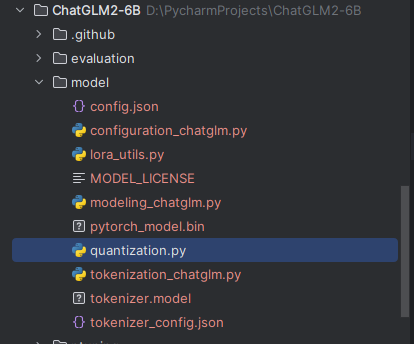
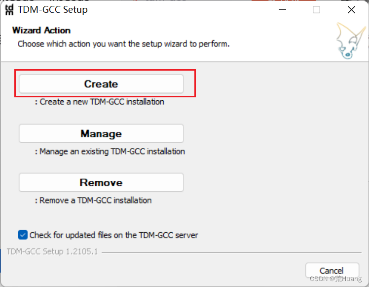
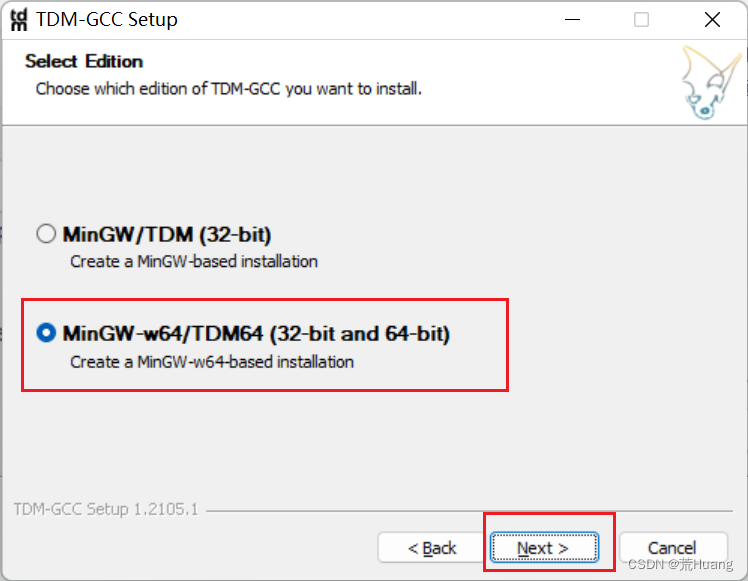
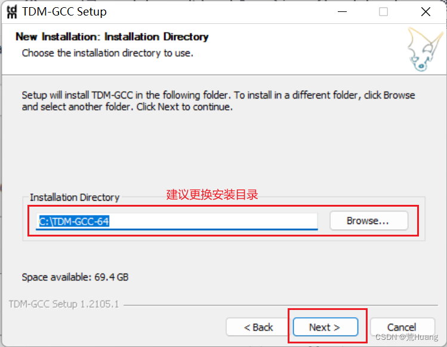
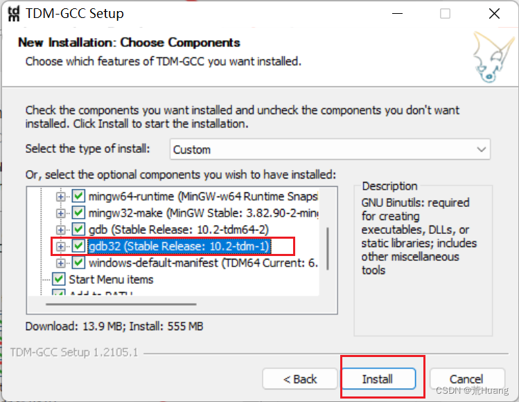
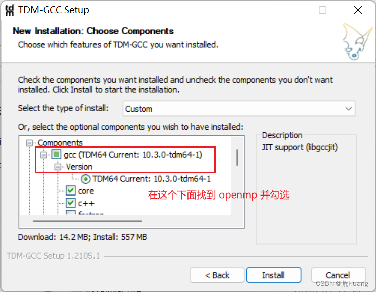
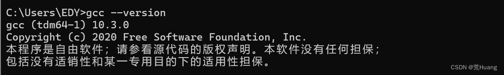
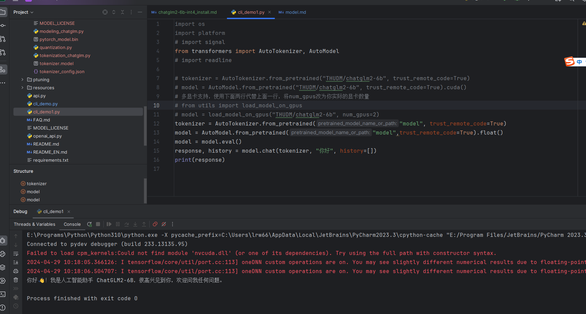

## win10安装chatglm2-6b-int4
### 1.下载chatgml2-6b
[下载代码](https://github.com/THUDM/ChatGLM2-6B)
### 2.下载模型
[THUDM/chatglm-6b-int4](https://cloud.tsinghua.edu.cn/d/674208019e314311ab5c/)
```
注意，还需包括,由于huggingface.co在大陆访问不了，所以要去githup去找
lora_utils.py
configuration_chatglm.py
config.json
modeling_chatglm.py
quantization.py
tokenization_chatglm.py
tokenizer_config.json
```
* 下载后


### 3.安装TDM-GCC






注意，如果gcc变异c不生效，需要重启pycharm，让环境变量生效。如我们cmd要重新开一个道理是一样的

### 3.修改quantization.py
```
在quantization.py 找到ctypes.cdll.LoadLibrary(kernel_file) 替换为ctypes.CDLL(kernel_file, winmode = 0)
#kernels = ctypes.cdll.LoadLibrary(kernel_file)
kernels = ctypes.CDLL(kernel_file, winmode = 0) 
```
### 4.简单测试


### 5安装依赖包
pip install -r requirements.txt

### 6.python版本
使用3.10.x
