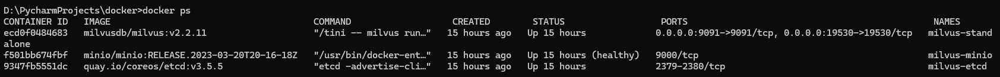
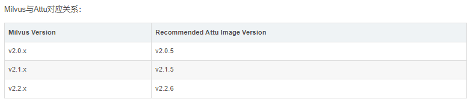

# windown 安装

```
1.下载
https://github.com/milvus-io/milvus/releases/download/v2.2.11/milvus-standalone-docker-compose.yml
2.重命名
下载的文件重命名为 docker-compose.yml
添加 Milvus可视化工具Attu
  # 增加attu容器，注意版本必须是v2.2.6
  attu:
    container_name: attu
    image: zilliz/attu:v2.2.6
    environment:
      MILVUS_URL: standalone:19530
    ports:
      - "3000:3000"
    depends_on:
      - "standalone"

3.安装
cmd打开命令窗口，执行指令 docker-compose up -d  
如果没有docker-compose 则先安装pip install docker-compose
4. 连接到Milvus
docker port milvus-standalone 19530/tcp
5 停止/启动Milvus
docker-compose down /docker-compose up -d
其他  docker-compose --help 查阅指令
6.删除数据 
启动目录的 volumes删除即可
7.使用
https://raw.githubusercontent.com/milvus-io/pymilvus/v2.2.8/examples/hello_milvus.py
https://blog.csdn.net/chy555chy/article/details/134077844
https://blog.csdn.net/lsb2002/article/details/132222947


```

